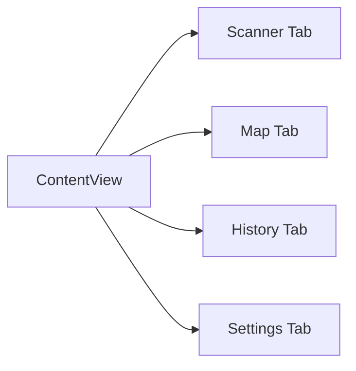
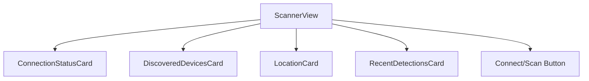
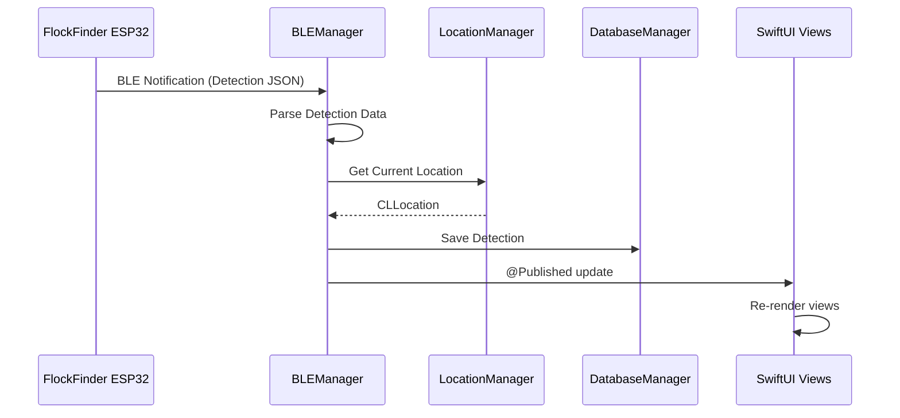

# Project Architecture

FlockFinder follows a clean SwiftUI architecture with clear separation of concerns. This document outlines the project structure and key components.

## Directory Structure

```
FlockFinderApp/
├── FlockFinder.xcodeproj/     # Xcode project configuration
└── FlockFinder/
    ├── FlockFinderApp.swift   # Main app entry point
    ├── Info.plist             # App configuration & permissions
    ├── Assets.xcassets/       # App icons, colors & images
    │
    ├── Models/
    │   └── FlockDetection.swift  # Core data models
    │
    ├── Views/
    │   ├── ContentView.swift     # Main tab navigation
    │   ├── MapView.swift         # Detection map with clustering
    │   ├── HistoryView.swift     # Detection history list
    │   ├── SettingsView.swift    # App configuration
    │   ├── DebugStreamView.swift # Raw BLE data viewer
    │   └── ...
    │
    └── Managers/
        ├── BLEManager.swift      # CoreBluetooth handling
        ├── LocationManager.swift # CoreLocation services
        ├── MotionManager.swift   # CoreMotion data
        └── DatabaseManager.swift # SQLite persistence
```

## Core Components

### App Entry Point

```swift title="FlockFinderApp.swift"
@main
struct FlockFinderApp: App {
    @StateObject private var bleManager = BLEManager()
    @StateObject private var locationManager = LocationManager()
    @StateObject private var databaseManager = DatabaseManager()
    
    var body: some Scene {
        WindowGroup {
            ContentView()
                .environmentObject(bleManager)
                .environmentObject(locationManager)
                .environmentObject(databaseManager)
        }
    }
}
```

The app uses `@StateObject` for manager classes and distributes them via `@EnvironmentObject` for access throughout the view hierarchy.

## Managers

### BLEManager

Handles all Bluetooth Low Energy communication with the FlockFinder ESP32 device.

| Property | Type | Description |
|----------|------|-------------|
| `isScanning` | `Bool` | Currently scanning for devices |
| `isConnected` | `Bool` | Connected to a FlockFinder device |
| `discoveredDevices` | `[DiscoveredDevice]` | Found BLE devices |
| `recentDetections` | `[FlockDetection]` | Latest detection alerts |
| `connectionState` | `ConnectionState` | Current BLE state |

**Key Methods:**

- `startScanning()` - Begin scanning for FlockFinder devices
- `stopScanning()` - Stop the BLE scan
- `connect(to:)` - Connect to a discovered device
- `disconnect()` - Disconnect from the current device

### LocationManager

Wraps CoreLocation for GPS data collection.

| Property | Type | Description |
|----------|------|-------------|
| `currentLocation` | `CLLocation?` | Current GPS position |
| `speed` | `Double` | Speed in meters/second |
| `headingDegrees` | `Double` | Compass heading |
| `authorizationStatus` | `CLAuthorizationStatus` | Permission state |

### MotionManager

Handles CoreMotion for activity recognition.

| Property | Type | Description |
|----------|------|-------------|
| `currentActivity` | `String` | Walking, driving, etc. |
| `isStationary` | `Bool` | Device is not moving |

### DatabaseManager

SQLite database for persistent storage.

| Method | Description |
|--------|-------------|
| `saveDetection(_:)` | Store a new detection |
| `getAllDetections()` | Retrieve all detections |
| `deleteDetection(_:)` | Remove a detection |
| `exportToCSV()` | Export data to CSV format |
| `exportToJSON()` | Export data to JSON format |
| `exportToGPX()` | Export data to GPX format |

## Models

### FlockDetection

The primary data model for surveillance camera detections.

```swift
struct FlockDetection: Identifiable, Codable, Equatable {
    let id: Int64
    let deviceType: DeviceType
    let macAddress: String?
    let ssid: String?
    let rssi: Int
    let confidence: Double
    let latitude: Double
    let longitude: Double
    let speed: Double?
    let heading: Double?
    let activity: String?
    let timestamp: Date
}
```

### DeviceType

Enum representing supported surveillance camera types.

```swift
enum DeviceType: String, Codable, CaseIterable {
    case flock = "Flock Safety"
    case verkada = "Verkada"
    case ring = "Ring"
    case nest = "Nest"
    case arlo = "Arlo"
    // ... and more
}
```

Each type has associated:

- `icon` - SF Symbol name
- `color` - SwiftUI Color for UI
- `description` - Human-readable description

## Views

### Tab Navigation

The app uses a `TabView` with four main sections:



| Tab | View | Purpose |
|-----|------|---------|
| Scanner | `ScannerView` | BLE connection & live detections |
| Map | `MapView` | Visual detection map |
| History | `HistoryView` | Detection list & search |
| Settings | `SettingsView` | App configuration |

### Scanner View Components



## Data Flow



## Threading Model

| Manager | Thread | Notes |
|---------|--------|-------|
| BLEManager | Main | CBCentralManager on main queue |
| LocationManager | Main | CLLocationManager delegate on main |
| MotionManager | Main | CMMotionActivityManager callback |
| DatabaseManager | Background | SQLite operations on background queue |

!!! tip "SwiftUI Updates"
    All `@Published` properties are updated on the main thread to ensure smooth UI updates.

## Next Steps

- [Learn about the BLE protocol](ble-protocol.md)
- [Explore detection types](detection-types.md)
- [Configure permissions](permissions.md)
