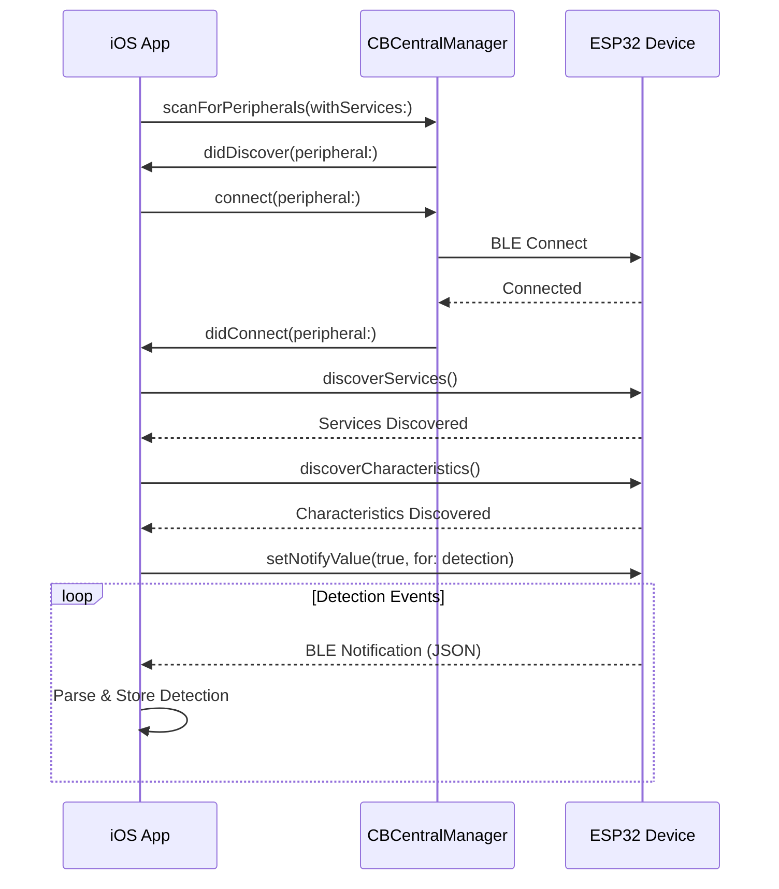

# BLE Protocol

The FlockFinder iOS app communicates with the ESP32-S3 device using Bluetooth Low Energy (BLE) GATT protocol. This document describes the communication protocol in detail.

!!! note "Firmware Compatibility"
    This app is designed to work with [oui-spy](https://github.com/VirtuallyScott/oui-spy), a fork of flock-you with BLE GATT server support.

## Service & Characteristics

### Service UUID

```
4fafc201-1fb5-459e-8fcc-c5c9c331914b
```

The FlockFinder device advertises this custom service UUID. The iOS app scans for devices advertising this service.

### Characteristics

| Characteristic | UUID | Properties | Description |
|----------------|------|------------|-------------|
| **Detection** | `beb5483e-36e1-4688-b7f5-ea07361b26a8` | Notify | Surveillance camera detection alerts |
| **Command** | `beb5483e-36e1-4688-b7f5-ea07361b26a9` | Write | Send commands to device |
| **Stream** | `beb5483e-36e1-4688-b7f5-ea07361b26aa` | Notify | Live scan data stream |

## Device Discovery

The app scans for BLE devices matching these criteria:

1. **Service UUID** - Devices advertising the FlockFinder service
2. **Name Patterns** - Devices with names containing:
   - `FlockFinder`
   - `Flock`
   - `Feather`
   - `ESP32`
   - `S3`

```swift
static let deviceNamePatterns = ["flockfinder", "flock", "feather", "esp32", "s3"]
```

## Detection Data Format

When the ESP32 detects a surveillance camera, it sends a JSON payload via the Detection characteristic:

### JSON Schema

```json
{
  "type": "Flock Safety",
  "mac": "AA:BB:CC:DD:EE:FF",
  "ssid": "FLOCK-CAM-001",
  "rssi": -55,
  "confidence": 0.95,
  "ts": 123456789
}
```

### Field Descriptions

| Field | Type | Required | Description |
|-------|------|----------|-------------|
| `type` | string | ✅ | Detection type (see [Detection Types](detection-types.md)) |
| `mac` | string | ❌ | MAC address of detected device |
| `ssid` | string | ❌ | WiFi SSID if applicable |
| `rssi` | integer | ✅ | Signal strength in dBm |
| `confidence` | float | ✅ | Detection confidence (0.0 - 1.0) |
| `ts` | integer | ❌ | Unix timestamp from device |

### Example Detections

=== "Flock Safety ALPR"

    ```json
    {
      "type": "Flock Safety",
      "mac": "3C:71:BF:12:34:56",
      "ssid": "FLOCK-S3-1234",
      "rssi": -62,
      "confidence": 0.98,
      "ts": 1704307200
    }
    ```

=== "Ring Doorbell"

    ```json
    {
      "type": "Ring",
      "mac": "A4:83:E7:AB:CD:EF",
      "ssid": "Ring Doorbell Pro",
      "rssi": -71,
      "confidence": 0.85,
      "ts": 1704307200
    }
    ```

=== "Unknown Device"

    ```json
    {
      "type": "Unknown",
      "mac": "00:11:22:33:44:55",
      "rssi": -78,
      "confidence": 0.45,
      "ts": 1704307200
    }
    ```

## Connection Flow



## Connection States

```swift
enum ConnectionState: String {
    case disconnected = "Disconnected"
    case scanning = "Scanning..."
    case connecting = "Connecting..."
    case connected = "Connected"
    case discovering = "Discovering Services..."
    case bluetoothOff = "Bluetooth Off"
    case unauthorized = "Bluetooth Unauthorized"
}
```

## Command Protocol

The app can send commands to the ESP32 via the Command characteristic:

| Command | Description |
|---------|-------------|
| `PING` | Connection keep-alive |
| `STATUS` | Request device status |
| `RESET` | Reset detection counters |

Commands are sent as UTF-8 encoded strings:

```swift
func sendCommand(_ command: String) {
    guard let data = command.data(using: .utf8),
          let characteristic = commandCharacteristic else { return }
    connectedDevice?.writeValue(data, for: characteristic, type: .withResponse)
}
```

## Live Stream

The Stream characteristic provides real-time scan data for debugging:

- WiFi networks being scanned
- BLE devices in range
- Detection algorithm state

Enable the Debug Stream View in the app to see this data.

## Signal Strength

RSSI values indicate proximity to detected devices:

| RSSI Range | Distance | Indication |
|------------|----------|------------|
| -30 to -50 | Very close | < 2 meters |
| -50 to -70 | Close | 2-10 meters |
| -70 to -85 | Medium | 10-30 meters |
| -85 to -100 | Far | > 30 meters |

!!! note "RSSI Accuracy"
    RSSI is affected by obstacles, interference, and antenna orientation. Use as a rough proximity indicator only.

## Error Handling

The app handles common BLE errors:

| Error | Handling |
|-------|----------|
| Bluetooth Off | Show alert, guide to Settings |
| Connection Lost | Automatic reconnection attempts |
| Service Not Found | Display error, suggest firmware update |
| Parse Error | Log error, continue listening |

## Firmware Compatibility

Ensure your ESP32 device is running compatible firmware:

```bash
cd flock-you
pio run -e um_feathers3 -t upload
```

The device should advertise as "FlockFinder-S3" when properly configured.

## Next Steps

- [Explore detection types](detection-types.md)
- [Configure permissions](permissions.md)
- [View project architecture](architecture.md)
