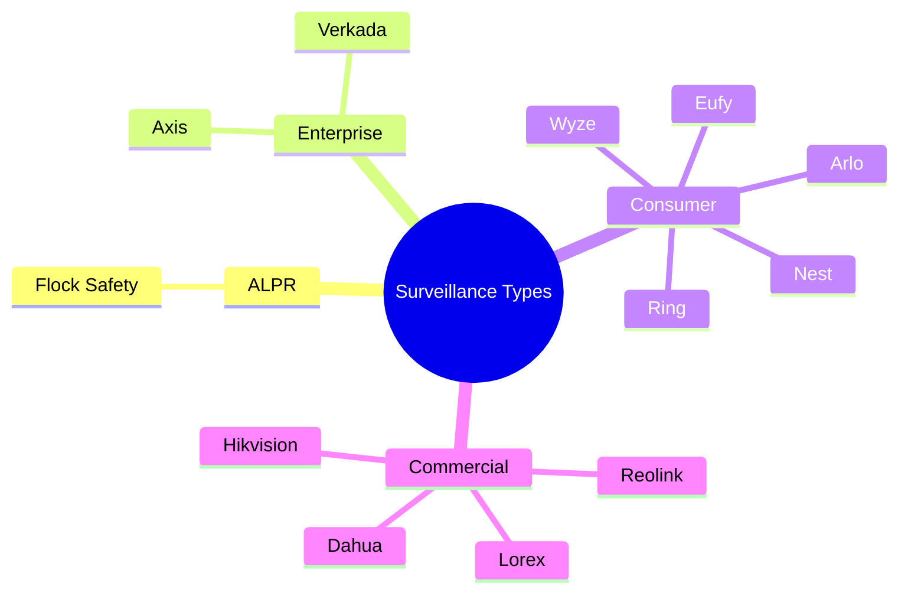

# Detection Types

FlockFinder recognizes various surveillance camera systems. This page documents all supported detection types, their characteristics, and visual identifiers.

## Surveillance Categories



## Detection Reference

### :material-car: Flock Safety

<div class="detection-card flock">

| Property | Value |
|----------|-------|
| **Type** | ALPR (Automated License Plate Recognition) |
| **Operator** | Law Enforcement Agencies |
| **Color** | 🔴 Red |
| **Icon** | `car.fill` |

**Description:** Flock Safety cameras are automated license plate recognition systems deployed by law enforcement agencies across the United States. They capture license plates and vehicle characteristics to track vehicle movements.

**Identification Patterns:**

- SSID: `FLOCK-*`, `FLK-*`
- MAC OUI: Multiple vendors
- Often mounted on poles at intersections

</div>

---

### :material-office-building: Verkada

| Property | Value |
|----------|-------|
| **Type** | Enterprise Security |
| **Operator** | Businesses, Schools, Government |
| **Color** | 🟠 Orange |
| **Icon** | `building.2.fill` |

**Description:** Verkada is a cloud-based enterprise security platform used by businesses, schools, and government facilities. Features AI-powered analytics and facial recognition capabilities.

**Identification Patterns:**

- SSID: `Verkada-*`
- Cloud-connected devices

---

### :material-bell: Ring

| Property | Value |
|----------|-------|
| **Type** | Consumer Smart Doorbell/Camera |
| **Operator** | Amazon / Residential |
| **Color** | 🩵 Cyan |
| **Icon** | `bell.fill` |

**Description:** Ring is Amazon's smart home security brand, featuring doorbells and cameras. Known for neighborhood sharing features and law enforcement partnerships.

**Identification Patterns:**

- SSID: `Ring-*`, `Ring Doorbell*`
- MAC OUI: `A4:83:E7` and others

---

### :material-home: Nest

| Property | Value |
|----------|-------|
| **Type** | Consumer Smart Camera |
| **Operator** | Google / Residential |
| **Color** | 🩶 Teal |
| **Icon** | `house.fill` |

**Description:** Google Nest cameras are part of the Google smart home ecosystem. Features include facial recognition, activity zones, and 24/7 recording.

**Identification Patterns:**

- SSID: `Nest-*`, `Google Nest*`
- MAC OUI: Google/Nest prefixes

---

### :material-camera: Arlo

| Property | Value |
|----------|-------|
| **Type** | Wireless Security Camera |
| **Operator** | Residential |
| **Color** | 🟢 Green |
| **Icon** | `camera.fill` |

**Description:** Arlo produces wireless security cameras popular for residential use. Known for battery-powered operation and weather resistance.

---

### :material-camera: Wyze

| Property | Value |
|----------|-------|
| **Type** | Budget Smart Camera |
| **Operator** | Residential |
| **Color** | 🟢 Green |
| **Icon** | `camera.fill` |

**Description:** Wyze offers affordable smart home cameras with cloud and local storage options.

---

### :material-camera: Eufy

| Property | Value |
|----------|-------|
| **Type** | Smart Home Security |
| **Operator** | Residential |
| **Color** | 🟢 Green |
| **Icon** | `camera.fill` |

**Description:** Eufy (by Anker) provides smart home security cameras with local storage focus and no monthly fees.

---

### :material-video: Lorex

| Property | Value |
|----------|-------|
| **Type** | Consumer/Commercial Security |
| **Operator** | Residential / Business |
| **Color** | 🔵 Blue |
| **Icon** | `video.fill` |

**Description:** Lorex produces wired and wireless security camera systems for home and business use.

---

### :material-video: Reolink

| Property | Value |
|----------|-------|
| **Type** | IP Security Camera |
| **Operator** | Residential / Business |
| **Color** | 🔵 Blue |
| **Icon** | `video.fill` |

**Description:** Reolink manufactures IP cameras with PoE and wireless options, popular for DIY security setups.

---

### :material-video: Axis Communications

| Property | Value |
|----------|-------|
| **Type** | Professional IP Camera |
| **Operator** | Enterprise / Government |
| **Color** | 🟡 Yellow |
| **Icon** | `video.fill` |

**Description:** Axis is a Swedish manufacturer of professional network cameras used in enterprise and government installations.

---

### :material-video: Hikvision

| Property | Value |
|----------|-------|
| **Type** | Commercial Surveillance |
| **Operator** | Various |
| **Color** | 🟣 Purple |
| **Icon** | `video.fill` |

**Description:** Hikvision is a Chinese state-owned surveillance equipment manufacturer. One of the world's largest security camera companies.

!!! warning "Security Concerns"
    Hikvision has been flagged by various governments for security concerns and is banned from certain government installations.

---

### :material-video: Dahua

| Property | Value |
|----------|-------|
| **Type** | Commercial Surveillance |
| **Operator** | Various |
| **Color** | 🟣 Purple |
| **Icon** | `video.fill` |

**Description:** Dahua Technology is a Chinese video surveillance products and services company. Similar to Hikvision in market position.

!!! warning "Security Concerns"
    Dahua has similar security concerns and restrictions as Hikvision in some jurisdictions.

---

### :material-help-circle: Unknown

| Property | Value |
|----------|-------|
| **Type** | Unidentified Surveillance Device |
| **Color** | ⚪ Gray |
| **Icon** | `questionmark.circle.fill` |

**Description:** Devices that match surveillance patterns but cannot be definitively identified. May represent new or uncommon camera systems.

## Detection Confidence

The confidence score (0.0 - 1.0) indicates how certain the detection is:

| Confidence | Meaning |
|------------|---------|
| 0.90 - 1.00 | **High** - Strong match on multiple identifiers |
| 0.70 - 0.89 | **Medium** - Good match on primary identifiers |
| 0.50 - 0.69 | **Low** - Partial match, may be false positive |
| < 0.50 | **Very Low** - Uncertain, requires verification |

## Color Legend

The app uses consistent colors for quick visual identification:

```swift
var color: Color {
    switch self {
    case .flock:     return .red      // Law enforcement ALPR
    case .verkada:   return .orange   // Enterprise
    case .ring:      return .cyan     // Amazon
    case .nest:      return .teal     // Google
    case .arlo, .wyze, .eufy: return .green  // Consumer
    case .lorex, .reolink:    return .blue   // Commercial
    case .axis:      return .yellow   // Professional
    case .hikvision, .dahua:  return .purple // Chinese manufacturers
    case .unknown:   return .gray     // Unknown
    }
}
```

## Adding New Detection Types

To add support for new surveillance systems:

1. Add case to `DeviceType` enum in [FlockDetection.swift](architecture.md)
2. Define icon, color, and description
3. Update ESP32 firmware with detection patterns
4. Submit pull request with documentation

## Next Steps

- [Configure permissions](permissions.md)
- [View BLE protocol](ble-protocol.md)
- [Explore architecture](architecture.md)
