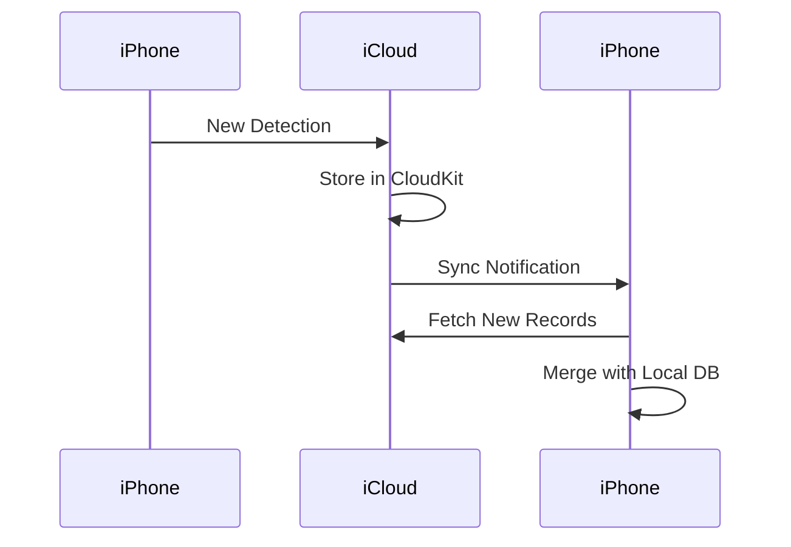

# iCloud Setup

FlockFinder supports optional iCloud sync to keep your detection data synchronized across devices and backed up to the cloud.

## Overview

| Feature | Description |
|---------|-------------|
| **Multi-device sync** | Access detections on all your iOS devices |
| **Automatic backup** | Data safely stored in iCloud |
| **Conflict resolution** | Smart merging of detection records |
| **Privacy** | Data stays in your personal iCloud account |

## Requirements

- iOS 16.0 or later
- iCloud account signed in on device
- iCloud Drive enabled
- Sufficient iCloud storage

## Enabling iCloud Sync

### In the App

1. Open **Settings** tab
2. Scroll to **Data & Storage**
3. Toggle **iCloud Sync** on
4. Confirm when prompted

### iCloud Must Be Enabled

If iCloud is not available, the toggle will be disabled. Check:

1. **Settings > [Your Name] > iCloud**
2. Ensure **iCloud Drive** is enabled
3. Verify you're signed in with an Apple ID

## How It Works



### Sync Process

1. **Detection logged** locally to SQLite
2. **iCloudManager** queues record for sync
3. **CloudKit** uploads to your iCloud account
4. **Other devices** receive change notifications
5. **Auto-merge** combines records on each device

## Data Storage

### CloudKit Container

FlockFinder uses a private CloudKit container:

```
iCloud.com.yourcompany.FlockFinder
```

Data is stored in your **private database**, visible only to you.

### Record Types

| Type | Contents |
|------|----------|
| `Detection` | Individual detection records |
| `Settings` | Synced app preferences |

## Conflict Resolution

When the same detection exists on multiple devices:

1. **Unique ID check** - Detections matched by UUID
2. **Timestamp comparison** - Newer data wins
3. **Field merge** - Missing fields filled from any source

!!! note "Offline Mode"
    Detections logged offline will sync automatically when connectivity is restored.

## Storage Usage

Check your iCloud storage usage:

1. **Settings > [Your Name] > iCloud > Manage Account Storage**
2. Look for FlockFinder in the list

Typical storage:

| Detections | Approximate Size |
|------------|------------------|
| 100 | ~50 KB |
| 1,000 | ~500 KB |
| 10,000 | ~5 MB |

## Troubleshooting

### Sync Not Working

1. **Check iCloud status** at [apple.com/support/systemstatus](https://www.apple.com/support/systemstatus/)
2. **Verify iCloud Drive** is enabled in Settings
3. **Check internet connection**
4. **Force sync** by toggling iCloud off and on in app

### Data Not Appearing on Other Device

1. Ensure **same Apple ID** on both devices
2. Wait a few minutes for sync
3. Open the app on both devices to trigger sync
4. Check **iCloud Drive** is enabled on both devices

### Storage Full

If iCloud storage is full:

1. Upgrade iCloud storage plan
2. Delete old detections in the History tab
3. Free up iCloud space from other apps

### Duplicate Detections

If you see duplicates after sync:

1. Open **History** tab
2. Use **Merge Duplicates** in settings (if available)
3. Manually delete duplicates

## Privacy Considerations

| Aspect | Details |
|--------|---------|
| **Encryption** | Data encrypted in transit and at rest |
| **Access** | Only accessible with your Apple ID |
| **Sharing** | Never shared with third parties |
| **Deletion** | Removed when you delete from all devices |

!!! info "Apple's Privacy Policy"
    iCloud data is subject to Apple's privacy policy. Apple cannot access your encrypted CloudKit data.

## Disabling iCloud Sync

To disable sync while keeping local data:

1. Open **Settings** tab
2. Toggle **iCloud Sync** off
3. Choose **Keep Local Data** when prompted

To remove data from iCloud:

1. Toggle **iCloud Sync** off
2. Choose **Delete from iCloud** when prompted
3. Local data remains on current device

## Technical Details

### CloudKit Implementation

```swift
class iCloudManager: ObservableObject {
    let container = CKContainer(identifier: "iCloud.com.yourcompany.FlockFinder")
    let privateDatabase: CKDatabase
    
    func saveDetection(_ detection: FlockDetection) {
        let record = CKRecord(recordType: "Detection")
        record["deviceType"] = detection.deviceType.rawValue
        record["latitude"] = detection.latitude
        record["longitude"] = detection.longitude
        // ... populate fields
        
        privateDatabase.save(record) { _, error in
            if let error = error {
                print("Sync error: \(error)")
            }
        }
    }
}
```

### Entitlements

The app requires the following entitlement in `FlockFinder.entitlements`:

```xml
<key>com.apple.developer.icloud-container-identifiers</key>
<array>
    <string>iCloud.com.yourcompany.FlockFinder</string>
</array>
<key>com.apple.developer.icloud-services</key>
<array>
    <string>CloudKit</string>
</array>
```

## Next Steps

- [Export your data](data-export.md)
- [Configure permissions](permissions.md)
- [Return to home](index.md)
