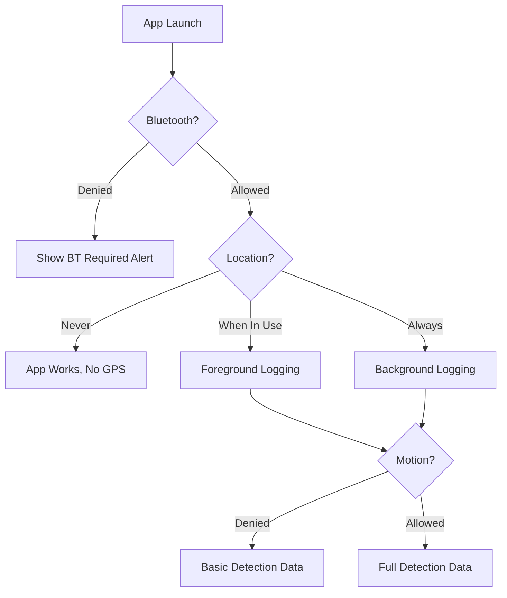

# App Permissions

FlockFinder requires several iOS permissions to function properly. This guide explains each permission and how to configure them.

## Required Permissions

| Permission | Purpose | Required |
|------------|---------|----------|
| **Bluetooth** | Connect to FlockFinder device | ✅ Yes |
| **Location (When In Use)** | Log detection coordinates | ✅ Yes |
| **Location (Always)** | Background detection logging | ⚡ Optional |
| **Motion & Fitness** | Record speed and heading | ⚡ Optional |

## Permission Configuration

### Info.plist Keys

The following keys are configured in `Info.plist`:

```xml
<!-- Bluetooth -->
<key>NSBluetoothAlwaysUsageDescription</key>
<string>FlockFinder needs Bluetooth to connect to your detection device.</string>

<key>NSBluetoothPeripheralUsageDescription</key>
<string>FlockFinder needs Bluetooth to communicate with the ESP32 detector.</string>

<!-- Location -->
<key>NSLocationWhenInUseUsageDescription</key>
<string>FlockFinder needs your location to log where detections occur.</string>

<key>NSLocationAlwaysAndWhenInUseUsageDescription</key>
<string>FlockFinder needs background location access to log detections while driving.</string>

<!-- Motion -->
<key>NSMotionUsageDescription</key>
<string>FlockFinder uses motion data to record your speed and direction of travel.</string>
```

## Bluetooth Permission

### Why It's Needed

Bluetooth Low Energy (BLE) is the primary communication method between your iPhone and the FlockFinder ESP32 device. Without Bluetooth access, the app cannot:

- Discover nearby FlockFinder devices
- Establish connections
- Receive detection notifications

### Granting Permission

1. When first launching the app, you'll see a Bluetooth permission prompt
2. Tap **"Allow"** to enable BLE access
3. If denied, go to **Settings > Privacy & Security > Bluetooth**
4. Find FlockFinder and toggle on

!!! warning "Bluetooth Denied"
    If Bluetooth is denied, the app will show `connectionState: .unauthorized` and cannot scan for devices.

## Location Permission

### Why It's Needed

Location services allow FlockFinder to:

- Record GPS coordinates for each detection
- Calculate speed and heading
- Display detections on the map
- Export GPX tracks

### Permission Levels

=== "When In Use"

    **Recommended for basic use**
    
    - Location recorded while app is in foreground
    - Battery efficient
    - Detections logged only when actively using the app

=== "Always"

    **Recommended for comprehensive logging**
    
    - Location recorded even when app is in background
    - Higher battery usage
    - Logs detections while driving with screen off
    - Required for background BLE notifications

### Granting Permission

1. The app will request location when you open the Scanner tab
2. Select **"Allow While Using App"** or **"Allow Always"**
3. For background logging, select **"Change to Always Allow"** when prompted

### Changing Permission Later

**Settings > Privacy & Security > Location Services > FlockFinder**

Options:

- Never
- Ask Next Time Or When I Share
- While Using the App
- Always

!!! tip "Precise Location"
    Keep **Precise Location** enabled for accurate GPS coordinates. Approximate location will still work but with reduced accuracy.

## Motion & Fitness Permission

### Why It's Needed

Motion data enhances detection records with:

- **Activity Type** - Walking, running, driving, cycling
- **Speed** - Current velocity
- **Heading** - Compass direction of travel
- **Stationary Detection** - Know if you're stopped at a location

### Granting Permission

1. When accessing motion data, you'll see a permission prompt
2. Tap **"Allow"** to enable motion access
3. If denied, go to **Settings > Privacy & Security > Motion & Fitness**

### Without Motion Permission

The app functions without motion data, but detections will lack:

- Activity classification
- Precise heading (falls back to GPS heading)
- Stationary/moving indicators

## Permission Flow



## Troubleshooting

### "Bluetooth is Off"

1. Open Control Center (swipe down from top-right)
2. Tap the Bluetooth icon to enable
3. Or go to **Settings > Bluetooth** and toggle on

### "Location Services Disabled"

1. Go to **Settings > Privacy & Security > Location Services**
2. Toggle **Location Services** on
3. Scroll down and ensure FlockFinder has permission

### "Precise Location is Off"

1. **Settings > Privacy & Security > Location Services > FlockFinder**
2. Toggle **Precise Location** on

### Background Location Not Working

1. Ensure "Always" location permission is granted
2. Check **Settings > General > Background App Refresh**
3. Enable background refresh for FlockFinder

### Permissions Reset After Update

iOS may reset permissions after app updates. Simply re-grant permissions when prompted.

## Privacy Considerations

FlockFinder takes privacy seriously:

| Data | Storage | Sharing |
|------|---------|---------|
| Detection locations | Local device only | Never without consent |
| GPS coordinates | Local SQLite database | Optional export |
| Motion data | Used in real-time, not stored | Never |
| Bluetooth data | Connection only | Never |

!!! info "iCloud Sync"
    If iCloud sync is enabled, detection data syncs to your personal iCloud account only. No data is shared with third parties.

## Next Steps

- [Build the app](building.md)
- [Connect to your device](ble-protocol.md)
- [Explore detection types](detection-types.md)
