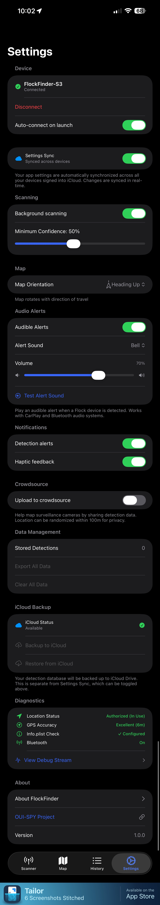

# User Guide

This guide walks you through using the FlockFinder iOS app to detect and log surveillance cameras.

## App Overview

FlockFinder has four main tabs at the bottom of the screen:

| Tab | Icon | Purpose |
|-----|------|---------|
| **Scanner** | 📡 | Connect to your FlockFinder device and view real-time detections |
| **Map** | 🗺️ | Visualize detection locations on an interactive map |
| **History** | 📋 | Browse, search, and export your detection history |
| **Settings** | ⚙️ | Configure device, alerts, and app preferences |

---

## Scanner Tab

The Scanner tab is your primary interface for connecting to your FlockFinder ESP32 device and monitoring real-time detections.

{ width="300" align="center" }

### Connection Status

At the top of the Scanner view, you'll see a connection status card showing:

- **Connection state** - Disconnected, Scanning, Connecting, or Connected
- **Device name** - The name of your FlockFinder device when connected
- **Status message** - Current activity or error information

### Scanning for Devices

1. Tap the **"Scan for FlockFinder"** button at the bottom
2. The app will search for nearby FlockFinder devices
3. Discovered devices appear in a list
4. Tap a device to connect

!!! tip "Auto-Connect"
    Enable "Auto-connect on launch" in Settings to automatically reconnect to your last device.

### Current Location

The location card displays your current:

- **GPS Coordinates** - Latitude and longitude
- **Speed** - Current travel speed (mph/kph)
- **Heading** - Direction of travel in degrees

### Recent Detections

When connected, the Recent Detections card shows the latest camera detections in real-time, including:

- Device type and icon
- Signal strength (RSSI)
- Confidence level
- Timestamp

---

## Map Tab

The Map tab provides a visual overview of all your detection locations.

{ width="300" align="center" }

### Map Features

- **Detection Pins** - Color-coded pins for each detection type
- **User Location** - Blue dot showing your current position
- **Clustering** - Multiple nearby detections group together

### Map Controls

Floating buttons on the right side of the map:

| Button | Function |
|--------|----------|
| 🧭 | Toggle between North-up and Heading-up orientation |
| 📍 | Center map on your current location |
| 🔄 | Refresh detection markers |

### Viewing Detection Details

Tap any detection pin to view details:

- Device type and manufacturer
- Signal strength and confidence
- GPS coordinates
- Date and time logged

---

## History Tab

The History tab lets you browse, search, and manage all your logged detections.

{ width="300" align="center" }

### Statistics Header

At the top, scrollable badges show:

- **Total detection count**
- **Counts by device type** (Flock, Verkada, Ring, etc.)

Tap a badge to filter the list by that device type.

### Search and Filter

- **Search bar** - Find detections by MAC address, SSID, or device type
- **Sort options** - Order by Newest, Oldest, Strongest Signal, or Highest Confidence

### Detection List

Each detection entry shows:

- Device type icon and name
- Signal strength indicator
- Confidence percentage
- Timestamp
- Location preview

### Exporting Data

Tap the export button (top right) to export detections in:

- **CSV** - Spreadsheet-compatible format
- **JSON** - Developer-friendly structured data
- **GPX** - GPS track for mapping applications

---

## Settings Tab

Configure FlockFinder behavior and preferences in the Settings tab.

{ width="300" align="center" }

### Device Settings

- **Connected device info** - Shows currently connected FlockFinder device
- **Disconnect button** - Manually disconnect from the device
- **Auto-connect on launch** - Automatically reconnect when app opens

### iCloud Sync

- **Settings Sync** - Sync your preferences across all devices signed into iCloud
- When enabled, changes to settings are automatically synchronized in real-time

### Scanning Options

- **Background scanning** - Continue scanning when app is in background
- **Minimum Confidence** - Filter out low-confidence detections (10% - 100%)

### Map Preferences

- **Map Orientation** - Choose between:
    - **North Up** - Map always oriented to north
    - **Heading Up** - Map rotates to match your direction of travel

### Audio Alerts

- **Audible Alerts** - Enable/disable sound notifications for detections
- **Alert Sound** - Choose from multiple alert sounds
- **Volume** - Adjust alert volume independently from system volume
- **Test Alert** - Preview the selected alert sound

!!! info "CarPlay & Bluetooth"
    Audio alerts automatically route to CarPlay or connected Bluetooth audio devices.

### Data Management

- **View record count** - See total number of stored detections
- **Clear all data** - Delete all detection history
- **Export data** - Backup your data to a file

### Diagnostics

The diagnostics section shows:

- Location permission status
- GPS accuracy level
- Bluetooth connection state
- Info.plist configuration status

---

## Connecting to Your Device

{ width="300" align="center" }

### First-Time Setup

1. **Power on** your FlockFinder ESP32 device
2. Open the FlockFinder app
3. Go to the **Scanner** tab
4. Tap **"Scan for FlockFinder"**
5. Grant Bluetooth permission when prompted
6. Select your device from the discovered list
7. Wait for connection to establish

### Connection States

| State | Description |
|-------|-------------|
| **Disconnected** | No device connected, ready to scan |
| **Scanning** | Actively searching for devices |
| **Connecting** | Establishing connection to selected device |
| **Discovering** | Setting up BLE services and characteristics |
| **Connected** | Successfully connected and receiving data |
| **Bluetooth Off** | Device Bluetooth is disabled |
| **Unauthorized** | Bluetooth permission not granted |

### Troubleshooting Connection Issues

!!! warning "Connection Problems?"
    
    **Device not found:**
    
    - Ensure your FlockFinder device is powered on
    - Check the device is in range (within ~30 feet)
    - Restart Bluetooth on your iPhone
    
    **Connection drops frequently:**
    
    - Move closer to the device
    - Check device battery level
    - Reduce interference from other Bluetooth devices
    
    **Unauthorized state:**
    
    - Go to Settings > Privacy & Security > Bluetooth
    - Enable Bluetooth access for FlockFinder

---

## Tips for Best Results

### Driving Mode

For optimal detection while driving:

1. Mount your iPhone where you can see the screen
2. Enable **Background scanning** in Settings
3. Enable **Audible Alerts** for hands-free notifications
4. Use **Heading-up** map orientation to match your direction

### Battery Optimization

To preserve battery life:

- Reduce GPS accuracy when not needed
- Use **When In Use** location permission instead of **Always**
- Disable background scanning when not actively detecting

### Data Management

- Regularly export your detection data for backup
- Enable iCloud Sync to preserve settings across devices
- Use filters in History to analyze specific camera types

---

## Quick Reference

| Action | How To |
|--------|--------|
| Connect to device | Scanner tab → Scan for FlockFinder → Select device |
| View detections on map | Map tab → Tap pins for details |
| Export data | History tab → Export button → Choose format |
| Change alert sound | Settings → Audio Alerts → Alert Sound |
| Clear all data | Settings → Data Management → Clear All |
| Check permissions | Settings → Diagnostics section |

---

*Need more help? Check out the [Building Guide](building.md) or [BLE Protocol](ble-protocol.md) documentation.*
